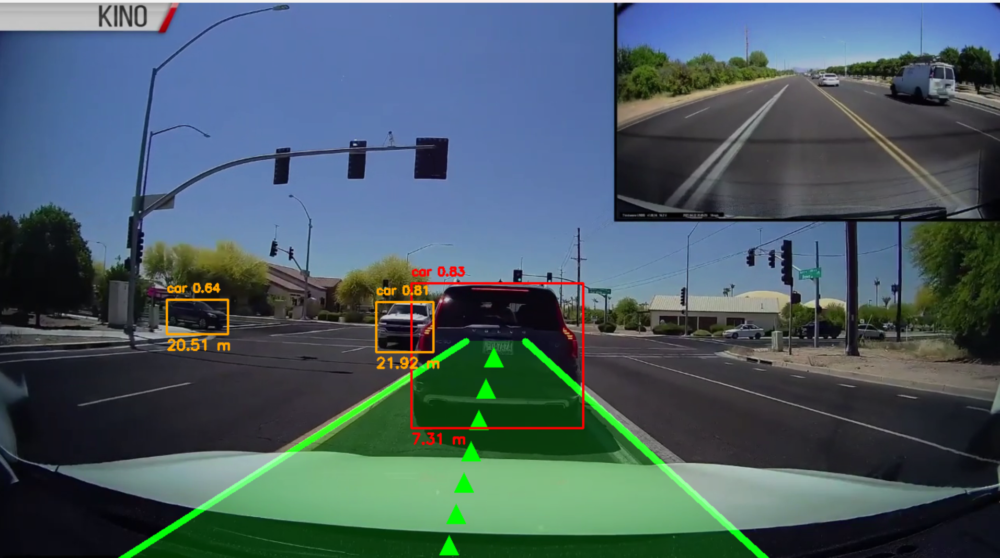

# Lane & Vehicle Detection with Distance Estimation (ADAS Simulation)

> Real-time road awareness using computer vision and deep learning.


---

## Table of Contents

1. [Problem Statement](#1-problem-statement)
2. [Tech Stack & Techniques](#2-tech-stack--techniques)
3. [What Makes This Project Unique](#3-what-makes-this-project-unique)
4. [Folder Structure](#4-folder-structure)
5. [How to Run](#5-how-to-run)
6. [Output](#output)
7. [Future Improvements](#future-improvements)
8. [Conclusion](#conclusion)

---

## 1. Problem Statement

Modern driving systems require real-time awareness of road conditions and nearby vehicles to improve safety. However, traditional systems struggle with:

- Detecting lanes in varying road conditions (dashed, faded, curved)
- Estimating distance to nearby vehicles
- Providing intuitive visual guidance to drivers

### Our Solution

This project builds a **real-time Advanced Driver Assistance System (ADAS) simulation** using computer vision and deep learning.

It can:

- Detect road lanes robustly (even with gaps)
- Identify vehicles using YOLOv8
- Estimate distance to detected vehicles
- Provide an intuitive visual interface (lane region + guiding path)

---

## 2. Tech Stack & Techniques

### Technologies

| Tool | Purpose |
|------|---------|
| Python | Core language |
| OpenCV | Image processing & lane detection |
| YOLOv8 (Ultralytics) | Object detection |
| PyTorch | Deep learning backend |
| NumPy | Numerical computations |

### Techniques

| Technique | Role |
|-----------|------|
| Canny Edge Detection | Edge extraction for lane finding |
| Hough Line Transform | Line detection from edges |
| Region of Interest Masking | Focus processing on road area |
| Morphological Operations | Gap filling in lane lines |
| Exponential Moving Average | Temporal lane smoothing |
| Perspective-style Visualization | ADAS-like lane overlay |
| Bounding Box Distance Estimation | Proximity calculation per vehicle |

---

## 3. What Makes This Project Unique

Unlike basic lane detection projects, this system includes:

**Lane Memory & Temporal Smoothing**
Handles dashed lanes and prevents flickering using previous frame information.

**Distance-Aware Vehicle Detection**
Vehicles are color-coded based on proximity — safe, warning, or danger.

**ADAS-Style Visualization**
Transparent lane region overlay, center guiding arrows, and a clean UI similar to self-driving systems.

**Real-Time Integration**
Combines classical CV and deep learning into a single pipeline.

---

## 4. Folder Structure

```
CV LANE DETECTION 2/
│
├── venv/                    # Virtual environment
├── videos/
│   ├── test.mp4
│   └── test2.mp4
│
├── weights/
│   └── yolov8n.pt
│
├── car_detection.py         # YOLOv8 vehicle detection
├── distance_estimator.py    # Distance calculation logic
├── lane_detection.py        # Lane detection pipeline
├── utils.py                 # Visualization utilities
├── main.py                  # Main execution script
├── requirements.txt         # Dependencies
└── README.md
```

---

## 5. How to Run

### Step 1 — Clone the repository

```bash
git clone https://github.com/ishant212/Lane-vehicle-detection
cd lane-car-detection
```

### Step 2 — Create virtual environment

```bash
python -m venv venv
venv\Scripts\activate  # Windows
```

### Step 3 — Install dependencies

```bash
pip install -r requirements.txt
```

### Step 4 — Download YOLOv8 weights

```bash
python -c "from ultralytics import YOLO; YOLO('yolov8n.pt')"
```

Move the downloaded file to:

```
weights/yolov8n.pt
```

### Step 5 — Run the project

```bash
python main.py
```

---

## Output


*Real-time detection — green lane overlay with guiding arrows, color-coded bounding boxes (orange = safe, red = danger), and per-vehicle distance labels.*

The system displays:

| Output | Description |
|--------|-------------|
| Lane overlay | Smooth detection with transparent region fill |
| Path guidance | Center arrows showing recommended trajectory |
| Vehicle detection | Bounding boxes via YOLOv8 |
| Distance estimation | Per-vehicle proximity measurement |

---

## Future Improvements

- [ ] Curved lane detection using polynomial fitting
- [ ] Bird's-eye view transformation
- [ ] Vehicle tracking & speed estimation
- [ ] Real-time webcam support

---

## Conclusion

This project demonstrates how **computer vision + deep learning** can be combined to simulate a real-world ADAS system, making it a strong portfolio project for roles in:

- Autonomous Driving
- Computer Vision
- AI/ML Engineering

---

> ⭐ If you like this project, consider giving it a star!